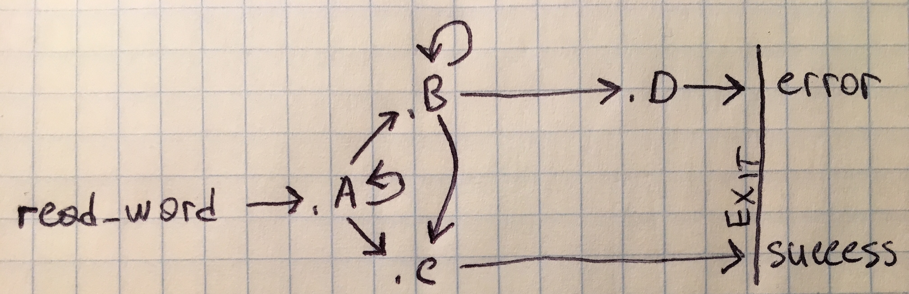

# Explanations for the io-library assignment

Here we provide explanations for the functions from io-library assignment from the original book.

The file `test.py` reads the `lib.inc` from the directory it is located and parses this file for testing purposes. So, let's
explain the `lib.inc`:

## Define code section

```asm
section .text
```

This defines code section, so we may put our code under it.

## Define `string_length` function

The `string_length` function is very simple. At first, we ensure that `rax` is zero by using `xor rax, rax`. Then we start a loop
with looking for `'\0'` on each its iteration. The check for zero is done via `cmp`. We use `cmp byte [rdi+rax]` because we want
only to check the byte part, not the whole 64-bit integer. The square brackets (`[` and `]`) is the **indirect adressing**
notation. The `[rdi+rax]` is a notation of **relative addressing** - we operate on a byte which starts from `rdi` with `rax`
offset. After check we either go to `.end` label which exits from the function with `ret` instruction which pops return address
from the stack and sets `RIP` to it, or continue the iteration by incrementing `rax` value and going to next iteration.

The source string (function argument) is passed through the `rdi` register. The function returns calculated string length through
the `rax` register.

```asm
string_length:
    xor rax, rax
.loop:
    cmp byte [rdi+rax], 0
    je .end 
    inc rax
    jmp .loop 
.end:
    ret
```

## Define `print_string` function

To print a string you must know its length before printing it, because in `write` system call you must pass a size of data which
you want to write. Before calling the `string_length` function, it would be good to save our registers onto stack. Actually, using our `string_length` implementation, it is not necessary to save it, we should do this because the `string_length` can
manipulate it someday and the only thing we were told is that the `string_length` accepts its source string argument through the
`rdi` register, we were told nothing whether it will manipulate it or not, or do anything else. This is some kind of "calling convention". So, we save `rdi` by pushing it onto stack before the call and return it into `rsi` right after call, because the
`write` system call gets data from `rsi` register, and more - `rdi` register is used for specifying destination file descriptor
- `1` in our case, which stands for `stdout`.

The source string (function argument) is passed through the `rdi` register. The function returns `void` in C-terminology, which
means it returns nothing (it is a procedure).

```asm
print_string:
    push rdi
    call string_length
    pop rsi
    mov rdx, rax 
    mov rax, 1
    mov rdi, 1 
    syscall
    ret
```
    
## Define `print_char` function

To print a char, we can use already implemented `print_string` function. The `print_string` can be used because it accepts
a pointer to data which is a byte-array. Byte-array of course can consist of one character. In C we would pretend that
it is a one-item byte array, but in asm we actually don't need to do anything at all. We simply pass an address to this `char`
scalar. We should remember about `print_string` limitation and that it does not say how it will work with registers, so we
should save our state and restore after. Even though saving of `rdi` register is done in `print_string`, we don't know that, as
we are a user of this code, not writer. Another advantage is that we allow `print_string` function to do anything with the `rdi`
because we saved it, and our `rdi` is actually a pointer to *our* stack which `print_string` can't manipulate at all. We should
restore the stack state after the job is done, so we `pop rdi` after calling the `print_string`.

The source character (function argument) is passed through the `rdi` register. The function returns `void` in C-terminology, which means it returns nothing (it is a procedure).

```asm
print_char:
    push rdi
    mov rdi, rsp
    call print_string 
    pop rdi
    ret
```

## Define `print_uint` function

Printing number is a little bit tricky thing. People familiar with C may know how to convert a number into string, because
the algorithm is very simple:

1. Get the source number.
2. Get the rightmost digit by taking a remainder of division by 10.
3. For converting it to ASCII-character, we simply [add `0x30` (or 48)](https://www.cs.cmu.edu/~pattis/15-1XX/common/handouts/ascii.html) to it.
4. Push it into an array, in reverse order, so that if we continue further, we will be able to read it in correct order.

Here, in assembly language, the basics are the same, but the implementation is of course, somewhat different. We will need a loop, of course, as same as we will need taking a remainder of division by 10 but we will not use any arrays. We will allocate
memory on stack and modify the contents right in there, and pass the pointer to the stack to the `print_string` function.

Let's start with copying `rdi` into `rax` because we will need to modify the `rdi` register later. Then, we need to keep current
`rsp` address in `rdi` because it will point to the end of our number's string representation on the stack later. We also will have to know the future string's ending, so we push `0` onto the stack marking it the end of our string. Then we allocate
16 bytes on the stack for our string by `sub rsp, 16`. Remember, that the stack grows to lower addresses from higher addresses? That is why the use `sub` for allocation, we move the `rsp` (stack pointer) down to lower addresses by 16 bytes. We then prepare
our division loop by pointing `rdi` to the first byte of our string on the stack and setting our divider into `r8` register.

Our loop starts with resetting `rdx` so we are sure we don't have a garbage in it. Then we perform the division and add `0x30`
via `or` instruction (a tricky-thing, yes). As you may know, applying *bitwise or* simply sets the bits in the destination register, if
they were not set before. We absolutely know that they were not set because *we* are the one who set the number by division, and
it contains a number between 0 and 9 (between `0000` and `1001`) while `0x30` (`48` in decimal) is `110000`, so we will never touch
the number part of register. Then, we decrement `rdi` (which points to stack, remember?) again and set the number we just calculated
(digit + `0x30`) into the value currently pointed by `rdi` register. As the last step, we check whether the remainder is zero after our manipulations (made by `div` instruction) and if it is, we exit the loop, otherwise we continue until it is zero.

After our loop is finished, the `rdi` points to the beginning of our new string on the stack, so we may safely call 
`print_string` function (it accepts its source string argument through the `rdi`, remember?). As we are good programmers and
we don't want to blow up the stack and to interrupt the program execution, we must deallocate the allocated stack memory (like
`free` in *C* or `delete` in *C++* when you are manipulating the memory manually - as we did here with stack by `sub`), we use
`add rsp, 24`. You may wonder why `24`, this is because we also added `0` onto the stack so we actually moved it by `8` and by
`16` bytes during the function execution, hence `24`. We must delete it too, because we must restore the stack after our job
is done, so we move the stack pointer up by `24` bytes and not `16`. We may have a useless number in the `rdi` register after our
manipulations, so it is good to reset it. Note, that we could also do this by `xor` instruction, or we could store it on the
stack before everything and then just pop it after, so the `print_uint` function user will keep the number in the `rdi` register
untouched after the call.

The source number (function argument) is passed through the `rdi` register. The function returns `void` in C-terminology, which means it returns nothing (it is a procedure).

```asm
print_uint:
    mov rax, rdi
    mov rdi, rsp
    push 0
    sub rsp, 16

    dec rdi
    mov r8, 10

.loop:
    xor rdx, rdx
    div r8
    or  dl, 0x30
    dec rdi
    mov [rdi], dl
    test rax, rax
    jnz .loop

    call print_string

    add rsp, 24
    mov rdi, 0
    ret

```

## Define `print_int` function

This should be very simple. We check whether it is a signed number passed or not. If it is signed, we print `'-'` character
and then call `print_uint` function with negated value. To negate value, we use `neg` instruction, which simply changes number's
sign from negative to positive and vice versa. You will not find a `call` instruction here and a line `call print_uint` because
this is unnecessary: we don't need to do anything else in the `print_int` function, so we simply continue working from the
`print_uint` label, it will do all the rest.

The source number (function argument) is passed through the `rdi` register. The function returns `void` in C-terminology, which means it returns nothing (it is a procedure).

```asm
print_int:
    test rdi, rdi
    jns print_uint
    push rdi
    mov rdi, '-'
    call print_char
    pop rdi
    neg rdi
    jmp print_uint
```

## Define `read_char` function

To read a char from `stdin`, we must perform `read` system call. Its arguments are exactly the same as in `write` system call.
As we need a char only, it is sufficient to allocate a single integer there by `push 0`. Then we perform system call which is
returned back to the userspace when we have a single char in our buffer what is our main goal here. As a last step, we have to
clean the stack and return the number in `rax` register, and we do this via a single instruction - `pop rax` which pops the
topmost value from the stack into the `rax` register.

The function has no input parameters. It returns read char in the `rax` register.

```asm
read_char:
    push 0
    xor rax, rax
    xor rdi, rdi
    mov rsi, rsp 
    mov rdx, 1
    syscall
    pop rax
    ret 
```

## Define `parse_uint` function

This function is exactly what we would do in C for converting a string into a number. The basic algorithm for C:

1. Iterate over a string and check the char is a digit. This could be done via `isdigit` function or manually by checking that
the character code is above than `'0'`'s characters code and less than `'9'`'s characters code. This can be done so easy because
the [ASCII table](https://www.cs.cmu.edu/~pattis/15-1XX/common/handouts/ascii.html) provides us with numbers in sequential
manner: the `0`'s code is `48` (or `0x30`), the `1`'s code is `49` (or `0x31`) and so on.
2. If the character is not a digit - exit with error or something like that, because we can't convert a string of text into a
number.
3. If it is a digit, we subtract `0x30` from the characters code and obtain a first digit.
4. We set the number to have this digit in this manner:

    > old number + just obtained digit * current offset from string + 1.
 
In *asm* it is again, a little bit more difficult but the algorithm remains the same.
 
We put a multiplier (`10`) into the `r8` register and initialize `rax` and `rcx` registers with zeros. We will store computed
number in the `rax` register and we will use `rcx` as a counter (like `i` in `for (int i = 0; i < string_length; ++i)`).

Our loop starts with moving the `rcx`h byte of the source string into `r9` with **zero extension** (it is copying of lower-sized
register into wider one with filling all the other bits with zero). It is done so for letting us performing operations with it
correctly. After copying a byte, we compare the register's value to `'0'`'s code and then to `'9'`'s code. If this byte of our string
is not in the range, we go to the `.end` label what means we had errorneous situation. If it is in the range, we continue our
loop by multiplying `rax` by `10` (stored in the `r8` register) with `mul r8` line. Right after that, we tricky subtract `0x30` from the current character's code resulting in something between `0` and `9` digits. This is done via `and` command. As we have
already told in `print_uint` function, this will work exactly as we want it to because of how the numbers are stored in memory.
For example, we have a `2` digit in the string (`'2'`) and we want to convert it into a number. We found, that `'2'` character's code,
according to the **ASCII table** is `50` or `0x32` in hex. To get a number from it, we must subtract `'0'` code or `0x30` from
it. Of course we could do this via `sub` instruction, but we are cool programmers and we will operate on bits in the byte.
If we look at the binary representation of `'2'` character, we will see `110010`. If we set first (highest) two bits to `0`, we will get a
`000010` number which is our number we want so much. We can do this via a `1111` (`0x0f` mask) and `and` instruction, so we reset 
two highest bits to zero by `and r9b, 0x0f`:

     110010
      and
     001111
       ==
     000010

After obtaining a number, we add it to the `rax` register so that the `rax` contains a number which should be used later for multipling and setting next digits of the number. To continue our loop, we must increment `rcx` register. When the job is done,
we will have a correct number in the `rax` register and its real length in the `rcx` register.
 
The source string address (function argument) is passed through the `rdi` register. The function returns converted number in
the `rax` register and in `rdx` - its length.

```asm
parse_uint:
    mov r8, 10
    xor rax, rax
    xor rcx, rcx
.loop:
    movzx r9, byte [rdi + rcx] 
    cmp r9b, '0'
    jb .end
    cmp r9b, '9'
    ja .end
    xor rdx, rdx 
    mul r8
    and r9b, 0x0f
    add rax, r9
    inc rcx 
    jmp .loop 
    .end:
    mov rdx, rcx
    ret
```

## Define `parse_int` function

Now we are able to define `parse_int` function. Its idea is equal to what we have done in `print_int` function:

1. We check whether the first string byte is equal to `'-'` (it means we have a negative integer passed as argument).
2. If it is not `'-'`, we simply jump to `parse_uint` label continuing the execution from there as we don't need to do anything
else here.
3. If it is `'-'`, we have to parse the *uint* part of it and then simply negate the computed by `parse_uint` value.

Sounds pretty simple, right?

In the beginning we set the `al` part of `rax` register to first byte from the `rdi` register and compare it to `'-'` character
code. If it is equal to it, we jump to the `.signed` label, otherwise we jump to `parse_uint` label and continue our execution
from there. In code which starts from `.signed` label we move `rdi` by one byte further so that if we pass it to the `parse_uint`
function, it will not have `'-'` in it. Then we perform a call to the `parse_uint` function which returns a value into `rax` and `rdx` registers, negate the computed value (set its sign to negative one), check that it is a correct number by checking the
length of it in stored in the `rdx` register and if everything is okay, we increment this length (`rdx`) because we have `'-'`.

The source string address (function argument) is passed through the `rdi` register. The function returns converted number in
the `rax` register and in `rdx` - its length.

```asm
parse_int:
    mov al, byte [rdi]
    cmp al, '-'
    je .signed
    jmp parse_uint
.signed:
    inc rdi
    call parse_uint
    neg rax
    test rdx, rdx
    jz .error

    inc rdx
    ret

    .error:
    xor rax, rax
    ret
```

## Define `string_equals` function

This function would be equal to one in C: compare two strings byte-after-byte, if any of bytes differs, return false, otherwise
return true.

We start with copying the first byte of `rdi` register into `al` register (`rax`'s lowest byte part) and comparing it after to
one in `rsi` register. If `zf` flag of `rflags` is set then the bytes are equal and we continue our process, otherwise we jump
to the `.no` label which simply sets `rax` to `0` and returns from the function. To continue our process, we must increment both
`rdi` and `rsi` addresses to make them point to the next byte. After that we check our exit condition - if the byte of string
passed in the `rdi` register is `'\0'`, we return `1`, otherwise we continue the iteration. This check is done via `test al, al` and `jnz string_equals` lines.

The source string addresses (function arguments) are passed through the `rdi` and `rsi` registers. The result is either `1` or
`0` and returned in the `rax` register working like `bool` function - if two strings are equal, `1` is returned, `0` otherwise.

```asm
string_equals:
    mov al, byte [rdi]
    cmp al, byte [rsi]
    jne .no
    inc rdi
    inc rsi
    test al, al
    jnz string_equals
    mov rax, 1
    ret
    .no:
    xor rax, rax
    ret 
```

# Define `string_copy` function

The algorithm is basically like that:

1. Calculate the source string length. If it is too long and destination string's length is not enough (the source string is too
big) we return with error.
2. Copy bytes from source string into destination string one after another in a loop with checking for `'\0'` symbol.

Calculating the source string length is fairly simple - just call `string_length` function but remember to keep our registers.
That is why we push them into stack before the call and pop after it. Then we compare source string length and destination string
length, if source string length is above destination string length - we jump to the `.too_long` label which simply zeroes the `rax`
register and returns from the function. If the lengths are okay, with push our source string because we will change the `rsi`
pointer after.

Our loop starts with copying the first byte pointed by the `rdi` register into the `dl` register (lowest part of the `rdx`
register) and then we copy it into the byte pointed by the `rsi` register. This could not be done via single instruction like
`mov byte[rsi], byte[rdi]` because such syntax would be illegal. Then we increment our pointers (`rdi` and `rsi` registers) and
perform check for the null symbol (`'\0'`). If there is a end of string (the null symbol is in the `dl` register), we exit the loop, pop old `rsi` pointer (which we pushed onto the stack right before the loop) into `rax` and return from the function,
otherwise we just continue the loop.

The source string address is passed through the `rdi` and the destination string is in the `rsi` register. The destination
string length is passed through the `rdx` register.

```asm
string_copy:
    push rdi
    push rsi
    push rdx
    call string_length
    pop rdx
    pop rsi
    pop rdi

    cmp rax, rdx
    jae .too_long  ; we also need to store null-terminator

    push rsi

        .loop:
        mov dl, byte[rdi]
        mov byte[rsi], dl
        inc rdi
        inc rsi
        test dl, dl
        jnz .loop

    pop rax
    ret

    .too_long:
    xor rax, rax
    ret
```

## Define `read_word` function

Now we are ready to write the most complex one, `read_word` function. The idea though is very simple - just read chars in a loop
until any white-space character is met. However, its implementation in the assembly language is quite complex. We will even touch
the `r14` and `r15` registers, use *4* labels. But nevertheless, the algorithm implemented is quite simple and there is just
many instructions in it, nothing really difficult there.

We allege that our function accepts a pointer to destination string where we will put the word read and the destination string
size which we must not exceed. If the word's length exceeds the desination string's length, we exit from the function. If it is
not, we put the new string into the `rax` register and its actual length into the `rdx` register. The word separator is, of
course, the whitespace characters. We treat ones as *space*, *tabulation* and *new line* characters.

The implementation starts with saving `r14` and `r15` registers by pushing both of them onto the stack. We will use the `r14`
register as word's length counter and `r15` as our original destination string's length which we should never exceed. We prepare
the state by decrementing `r15` so that we actually check the `(destination buffer length - 1)` value to exceed, because we
must put a null symbol there, so we can only store `(destination buffer length - 1)` useful bytes there.

You may find the code pointed by `.A` and `.B` labels almost equal. The difference is in jump table and the behavior: in `.A` we
expect the input to start with non-whitespace character and we are stuck in the loop which starts from `.A` label unless there is
a non-whitespace character (what signals that the word has started) while code in the `.B` loop does the opposite, it reads all
the non-whitespace characters until there is a whitespace character, in other words, it reads the word, so the algorithm is this:

1. Start with `.A` loop and read all the characters (by iterating in this loop) until we reach a non-whitespace character (the word start).
2. After that, check whether there is a `EOF` (`'\0'` character) suddenly came then jump to `.C`. If not, continue from `.B`.
3. If we continue from `.B`, we then read the word (characters in a loop) until we reach the first whitespace character, copying
bytes into the `rdi` register with `r14` offset (remember that `r14` stores word's length?). We also check whether we exceeded
the destination string's length or not, if we did, we go to `.D`.
4. From all the code we may go to `.C` - this is our successful end: we put null symbol there into our destination string,
set its actual length into the `rdx` register.

The graph looks like:



It would be much easier to understand if you change labels like this:

- `.A` to `.skip_whitespace`.
- `.B` to `.read_next_char`.
- `.C` to `.finish`.
- `.D` to `.err`.

The destination string address is passed through the `rdi` register and its length through the `rdx` register. The destination
string length is passed through the `rdx` register. The real destination string length will be saved into `rdx` register and
the string itself into the `rax` register.

```asm
read_word:
    push r14
    push r15
    xor r14, r14 
    mov r15, rsi
    dec r15

    .A:
    push rdi
    call read_char
    pop rdi
    cmp al, ' '
    je .A
    cmp al, 10
    je .A
    cmp al, 13
    je .A 
    cmp al, 9 
    je .A
    test al, al
    jz .C

    .B:
    mov byte [rdi + r14], al
    inc r14

    push rdi
    call read_char
    pop rdi
    cmp al, ' '
    je .C
    cmp al, 10
    je .C
    cmp al, 13
    je .C 
    cmp al, 9
    je .C
    test al, al
    jz .C
    cmp r14, r15
    je .D

    jmp .B

    .C:
    mov byte [rdi + r14], 0
    mov rax, rdi 
   
    mov rdx, r14 
    pop r15
    pop r14
    ret

    .D:
    xor rax, rax
    pop r15
    pop r14
    ret
```

As a bonus to this function, we provide a simple utility for reading a word which you may compile as usual:

```bash
nasm -felf64 word.asm -o word.o -g
ld -o word word.o
```

It will use most of the above functions to read a word and to output a human-readable string along with the exit code which will
be equal to the word's length.

The code of `word.asm`:

```asm
global _start

section .data
    you_entered_string: db "You entered: ", 0

section .text
	string_length:
	    xor rax, rax
	.loop:
	    cmp byte [rdi + rax], 0
	    je .end
	    inc rax
	    jmp .loop
	.end:
	    ret

	print_string:
	    ;; Push string address as argument for string_length
	    call string_length

	    ;; set string length
	    mov rdx, rax
	    ;; set string address
	    mov rsi, rdi
	    ;; set syscall number (write)
	    mov rax, 1
	    ;; set file descriptor (stdout)
	    mov rdi, 1
	    syscall

	    ret

	;; rdi - char address
	print_char:
	    push rdi
	    ;; set string length
	    mov rdx, 1
	    ;; set string address
	    mov rsi, rsp
	    ;; set syscall number (write)
	    mov rax, 1
	    ;; set file descriptor (stdout)
	    mov rdi, 1
	    syscall

	    pop rdi
	    ret


	read_char:
	    push 0

	    mov rax, 0
	    mov rdi, 0
	    mov rsi, rsp
	    mov rdx, 1
	    syscall

	    pop rax

	    ret

	print_newline:
	    mov rdi, 0x0a
	    call print_char
	    ret

	read_word:
	    push r14
	    push r15
	    xor r14, r14
	    mov r15, rsi
	    dec r15

	    .skip_whitespace:
	    push rdi
	    call read_char
	    pop rdi
	    cmp al, ' '
	    je .skip_whitespace
	    cmp al, 10
	    je .skip_whitespace
	    cmp al, 13
	    je .skip_whitespace
	    cmp al, 9
	    je .skip_whitespace
	    test al, al
	    jz .finish

	    .read_chars:
	    mov byte [rdi + r14], al
	    inc r14

	    push rdi
	    call read_char
	    pop rdi
	    cmp al, ' '
	    je .finish
	    cmp al, 10
	    je .finish
	    cmp al, 13
	    je .finish
	    cmp al, 9
	    je .finish
	    test al, al
	    jz .finish
	    cmp r14, r15
	    je .err

	    jmp .read_chars

	    .finish:
	    mov byte [rdi + r14], 0
	    mov rax, rdi

	    mov rdx, r14
	    pop r15
	    pop r14
	    ret

	    .err:
	    xor rax, rax
	    pop r15
	    pop r14
	    ret

    _start:
       ;; Allocate 16 bytes on the stack
        sub rsp, 16
        mov rsi, 16
        mov rdi, rsp
        call read_word

        push rdx
        push rdx
        push rax
        mov rdi, you_entered_string
        call print_string
        pop rdi
        call print_string
        pop rdi
        call print_newline
        add rsp, 16

        pop rdi
        mov rax, 60
        syscall
        ret
```

# Recommendations

If you don't understand how something works, here or anywhere else in assembly language, just use a debugger, go through the code
step-by-step keeping the state of everything in your mind, and you'll understand what is going on, what developer meant
writing this code. I personally recommend `pwndbg` extension for `gdb` debugger, it has very useful features and user interface.
